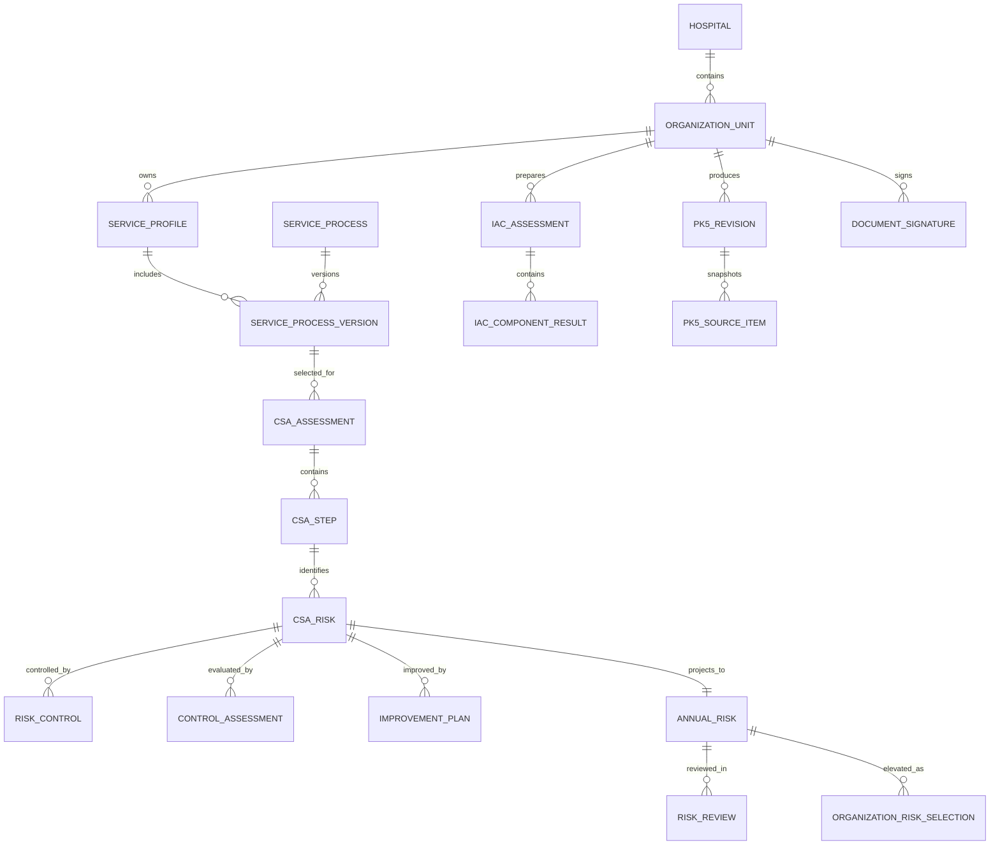

# IAC&Risk: Phase 0 Requirement and Domain Specification

สถานะเอกสาร: รับรองแล้ว และใช้เป็นข้อกำหนดสำหรับการพัฒนา
วันที่จัดทำ: 25 สิงหาคม 2569
ขอบเขต: การควบคุมภายใน (IAC) และการบริหารความเสี่ยง (Risk)

## 1. วัตถุประสงค์

พัฒนาโมดูล `IAC&Risk` สำหรับโรงพยาบาลหลายแห่ง โดยเชื่อมข้อมูล Service Profile, กระบวนงาน, CSA, Flow chart, บัญชีความเสี่ยง, ปค.4, ปค.5 และการติดตามผลเข้าด้วยกัน ลดการกรอกข้อมูลซ้ำ และตรวจสอบย้อนกลับถึงที่มาของข้อมูลได้

เอกสารนี้เป็นข้อกำหนดก่อนพัฒนา ยังไม่ใช่การอนุมัติ schema หรือการเริ่มสร้าง migration

## 2. ข้อกำหนดที่ยืนยันแล้ว

### 2.1 ขอบเขตองค์กรและเวลา

- ระบบรองรับหลายโรงพยาบาล และแยกข้อมูลตามโรงพยาบาล
- ใช้ปีงบประมาณ
- มีรอบติดตาม 6 เดือน, 9 เดือน และสิ้นปีงบประมาณ
- บัญชีความเสี่ยงแยกตามหน่วยงาน
- ความเสี่ยงชื่อเดียวกันสามารถเกิดซ้ำในหลายหน่วยงาน หลายกระบวนงาน หรือหลายขั้นตอนได้
- การรวมข้อมูลระดับโรงพยาบาลเป็นการทำรายงานภาพรวม ไม่รวมและไม่แก้รายการต้นทางของแต่ละหน่วยงาน

### 2.2 ชื่อระบบและคำศัพท์

- ชื่อเมนูและปุ่มหลักคือ `IAC&Risk`
- `HRMS` เป็นชื่อโปรแกรมความเสี่ยงของ HA ไม่ใช่ประเภทความเสี่ยง
- CSA ใช้สำหรับวิเคราะห์ที่มาและวิธีคิด ไม่ใช่เอกสารที่ต้องส่งออก
- ปค.5 แสดงเฉพาะความเสี่ยงที่มาจากการวิเคราะห์กระบวนงานผ่าน CSA
- บัญชีความเสี่ยงรวมทั้งความเสี่ยงจาก CSA และความเสี่ยงนอกกระบวนงาน

### 2.3 Service Profile และกระบวนงาน

- ใช้หัวข้อเดิม `5. กระบวนการหลักของหน่วยงาน`
- ใน Service Profile กรอกข้อมูลกระบวนงานเพียงชื่อและวัตถุประสงค์
- หน่วยงานเลือกทำ CSA เฉพาะบางกระบวนงาน ไม่บังคับทำทั้งหมด
- หนึ่งกระบวนงานมีหนึ่ง CSA ต่อหนึ่งปีงบประมาณ
- เมื่อเปิดปีใหม่ ระบบคัดลอก Service Profile ล่าสุดและกระบวนงานทั้งหมดเป็นฉบับร่างอัตโนมัติ
- เริ่มทำ CSA ได้ระหว่างทบทวน Service Profile ไม่ต้องรอ Service Profile รับรอง
- CSA เก็บ snapshot ชื่อและวัตถุประสงค์ของกระบวนงาน ณ วันที่เริ่มวิเคราะห์
- การแก้ชื่อหรือวัตถุประสงค์ผ่าน CSA/ปค.5 มีผลเฉพาะ snapshot ไม่ย้อนกลับไปแก้ Service Profile

### 2.4 โครงสร้าง CSA

ลำดับข้อมูลคือ:

```text
กระบวนงาน
└── วัตถุประสงค์
    └── ขั้นตอนการปฏิบัติงาน
        ├── ขั้นตอนที่ไม่มีความเสี่ยง
        └── ขั้นตอนที่มีความเสี่ยง
            └── ความเสี่ยงหนึ่งหรือหลายรายการ
                ├── สาเหตุและผลกระทบ
                ├── การควบคุมภายในที่มีอยู่
                ├── ผลประเมินความเพียงพอ
                ├── ความเสี่ยงคงเหลือ
                └── แผนแก้ไขเมื่อควบคุมไม่เพียงพอ
```

- ขั้นตอนที่ไม่มีความเสี่ยงเก็บใน CSA และแสดงใน Flow chart แต่ไม่แสดงใน ปค.5
- ความเสี่ยงทุกข้อจาก CSA แสดงใน ปค.5 ทั้งรายการที่ควบคุมได้ดีและควบคุมได้ไม่ดี
- ถ้าควบคุมไม่เพียงพอ ต้องมีวิธีแก้ไข ผู้รับผิดชอบ และกำหนดเสร็จ
- ความเสี่ยงจาก CSA แสดงในบัญชีความเสี่ยงและตัวอย่าง ปค.5 ได้ตั้งแต่ CSA เป็นฉบับร่าง

### 2.5 บัญชีความเสี่ยง

- ความเสี่ยงจาก CSA ต้องเชื่อมย้อนกลับถึง CSA, ขั้นตอน, กระบวนงาน และ Service Profile ได้
- เพิ่มความเสี่ยงนอกกระบวนงานได้โดยตรง โดยต้องระบุแหล่งที่มา
- ความเสี่ยงนอกกระบวนงานไม่แสดงใน ปค.5
- ไม่รวมรายการอัตโนมัติจากชื่อความเสี่ยง
- ความเสี่ยงชื่อเดียวกันจากหลายกระบวนงานเก็บแยก เพราะสาเหตุ การควบคุม และวิธีแก้ไขอาจต่างกัน
- ทีมประสานเลือกได้ทั้งความเสี่ยงจาก CSA และนอกกระบวนงานเพื่อยกระดับเป็นความเสี่ยงระดับโรงพยาบาล
- แม้ถูกยกระดับแล้ว รายการยังแยกตามหน่วยงาน รายงานภาพรวมเป็นเพียงการจัดกลุ่มเพื่อวิเคราะห์

### 2.6 ปค.5

- ปค.5 รวมข้อมูลจาก CSA ทุกฉบับของหน่วยงาน
- หนึ่งแถวข้อมูลแทนหนึ่งความเสี่ยง
- ช่อง (3)-(9) สร้างจากข้อมูล CSA โดยไม่กรอกซ้ำ
- ดูตัวอย่างบนเว็บได้ตั้งแต่เป็นฉบับร่าง
- ส่งออก Excel ได้เมื่อผู้จัดทำยืนยันและหัวหน้าหน่วยงานรับรองแล้ว
- ไม่ต้องรอทีมประสาน คณะกรรมการ หรือผู้อำนวยการเพื่อส่งออกระดับหน่วยงาน
- ทีมประสานแก้ข้อมูลได้โดยตรงและไม่ต้องให้หัวหน้าหน่วยงานรับรองซ้ำ
- หลังทีมประสานแก้ revision ล่าสุดเป็นฉบับปัจจุบันและส่งออก Excel ได้
- การแก้ผ่านหน้า ปค.5 ต้องปรับข้อมูลต้นทางใน CSA และบัญชีความเสี่ยงให้ตรงกัน
- revision ก่อนหน้ายังอยู่ในประวัติและดาวน์โหลดได้

### 2.7 ปค.4 และลายเซ็น

- ทุกหน่วยงานจัดทำ ปค.4 และรวบรวมเป็นระดับโรงพยาบาล
- ปค.4 ส่งออก Word เพื่อแก้ไข/ตรวจทาน และ PDF เพื่อเป็นเอกสารทางการ
- ใช้การลงนามแบบเดียวกับระบบวันลา คือยืนยันการลงนามในระบบและวางภาพลายเซ็นที่มีอยู่
- รองรับการพิมพ์เอกสารเพื่อลงนามจริง
- ไม่ใช่ Digital Certificate
- เอกสารที่ลงนามแล้วต้องล็อก revision; การแก้ไขสร้าง revision ใหม่

### 2.8 รูปแบบส่งออก

| เอกสาร | รูปแบบ |
|---|---|
| CSA | ใช้ในระบบเท่านั้น |
| Flow chart | PDF |
| ปค.4 | Word และ PDF |
| ปค.5 | Excel |

## 3. Source of Truth และ Snapshot

| ข้อมูล | Source of truth | หมายเหตุ |
|---|---|---|
| รายการกระบวนงานประจำปี | Service Profile | มี revision รายปี |
| ชื่อ/วัตถุประสงค์ที่ใช้วิเคราะห์ | CSA snapshot | ไม่เปลี่ยนตาม Service Profile อัตโนมัติ |
| ขั้นตอน | CSA | ใช้สร้าง Flow chart |
| ความเสี่ยงจากกระบวนงาน | CSA risk record | แสดงใน Risk register และ ปค.5 |
| การควบคุมและผลประเมิน | CSA | ปค.5 เป็นมุมมองจากข้อมูลนี้ |
| แผนแก้ไข | Control improvement plan | เชื่อมการติดตามแต่ละรอบ |
| ความเสี่ยงนอกกระบวนงาน | Annual risk register | ไม่เข้า ปค.5 |
| ปค.4 | IAC assessment | สรุประดับหน่วยงานและโรงพยาบาล |

กฎสำคัญ:

1. ห้ามเก็บข้อความ ปค.5 เป็นข้อมูลธุรกิจแยกจาก CSA
2. การแก้จากหน้า ปค.5 เป็นการแก้ข้อมูลต้นทางผ่านมุมมอง ปค.5
3. เอกสารที่ส่งออกต้องระบุ revision ต้นทาง
4. revision ที่ลงนามหรือรับรองแล้วห้ามเขียนทับ

## 4. Domain Model ที่เสนอ

ชื่อ table เป็น working name และต้องยืนยันอีกครั้งก่อนสร้าง migration



### 4.1 กลุ่มตารางหลัก

#### Tenancy และรอบปี

- `iac_risk_fiscal_year`
- `iac_risk_reporting_period`
- ใช้ organization unit เดิมของ ERP เป็นเจ้าของข้อมูล ไม่สร้างผังองค์กรซ้ำ

#### กระบวนงาน

- `iac_service_process`: ตัวตนถาวรของกระบวนงาน
- `iac_service_process_version`: ชื่อและวัตถุประสงค์ในแต่ละ Service Profile/revision
- `iac_process_review`: ผลทบทวน ใช้ต่อ/แก้ไข/ยกเลิก/เพิ่มใหม่

#### CSA

- `iac_csa`
- `iac_csa_step`
- `iac_csa_risk`
- `iac_risk_control`
- `iac_control_assessment`
- `iac_improvement_plan`
- `iac_improvement_update`

#### Risk register

- `iac_annual_risk`
- `iac_risk_impact_score`
- `iac_risk_review`
- `iac_organization_risk_selection`
- `iac_risk_source`

#### ปค.4 และ ปค.5

- `iac_assessment`
- `iac_component_result`
- `iac_pk4_revision`
- `iac_pk5_revision`
- `iac_pk5_source_item`
- `iac_document_signature`
- `iac_export_file`

#### Audit

- `iac_activity`
- `iac_change_set`
- `iac_change_item`

ทุกตารางใหม่ต้องมี `ref`, `created_at`, `updated_at`, `created_by`, `updated_by` ตามมาตรฐานโครงการ และไฟล์แนบต้องใช้ `modules/filemanager`

## 5. State Model

### 5.1 CSA

```text
draft
→ author_confirmed
→ head_pending
→ head_approved

head_pending → returned → draft
head_approved → coordinator_revised
```

- ความเสี่ยงจาก `draft` มองเห็นในบัญชีและตัวอย่าง ปค.5 โดยมีป้ายฉบับร่าง
- การส่งออก ปค.5 ยังทำไม่ได้จนกว่าทุก CSA ที่อยู่ในชุดรายงานจะผ่าน `head_approved` หรือ `coordinator_revised`

### 5.2 ปค.5 revision

```text
preview
→ ready_for_author
→ author_confirmed
→ head_approved
→ exportable
→ coordinator_revised
→ exportable (new current revision)
```

### 5.3 Service Profile

ใช้ workflow เดิมของ `modules/serviceProfile` ต่อไป โดยอนุญาตสร้าง CSA เมื่อ Service Profile อยู่ใน `draft` หรือ `returned` และกระบวนงานยังไม่ถูกยกเลิก

## 6. Permission Matrix

| การทำงาน | ผู้จัดทำ | ผู้รับมอบหมาย | หัวหน้าหน่วยงาน | ทีมประสาน | คณะกรรมการ | ผู้อำนวยการ | Admin |
|---|---:|---:|---:|---:|---:|---:|---:|
| ดูข้อมูลหน่วยงานตนเอง | ✓ | ✓ | ✓ | ✓ ทุกหน่วยงาน | ✓ ภาพรวม | ✓ ภาพรวม | ✓ |
| แก้ Service Profile ตามสิทธิ์เดิม | ✓ | ✓ | ✓ | ตามสิทธิ์เดิม | - | - | ✓ |
| เลือกกระบวนงานทำ CSA | ✓ | ✓ | ✓ | ✓ | - | - | ✓ |
| แก้ CSA ฉบับร่าง | ✓ | ✓ | ✓ | ✓ | - | - | ✓ |
| รับรอง CSA/ปค.5 หน่วยงาน | - | - | ✓ | - | - | - | ✓ |
| แก้หลังหัวหน้ารับรอง | - | - | - | ✓ | - | - | ✓ |
| ส่งออก ปค.5 | หลังรับรอง | หลังรับรอง | ✓ | ✓ | ดู | ดู | ✓ |
| ยกระดับความเสี่ยงองค์กร | - | - | เสนอ | ✓ | พิจารณา | ดู/รับรองตามนโยบาย | ✓ |
| ลงนาม ปค.4 ระดับองค์กร | - | - | ระดับหน่วยงาน | เตรียม | พิจารณา | ✓ | ตามสิทธิ์ |

หมายเหตุ: สิทธิ์จริงต้องตรวจทั้ง RBAC และขอบเขตโรงพยาบาล/หน่วยงานทุก action

## 7. Navigation และ Wireframe เชิงโครงสร้าง

### 7.1 เมนูหลัก

```text
IAC&Risk

[โรงพยาบาล] [ปีงบประมาณ] [รอบรายงาน] [หน่วยงาน]

ภาพรวม | Service Profile | กระบวนงาน | CSA | บัญชีความเสี่ยง
       | ปค.4 | ปค.5 | ติดตามผล | ประวัติ
```

บริบทที่เลือกต้องคงอยู่ขณะเปลี่ยนเมนู และทุก query ต้องบังคับ scope ฝั่ง server ไม่พึ่งค่าจาก UI อย่างเดียว

### 7.2 หัวข้อกระบวนงานใน Service Profile

```text
5. กระบวนการหลักของหน่วยงาน                         [เพิ่มกระบวนงาน]

ลำดับ | ชื่อกระบวนงาน | วัตถุประสงค์ | สถานะทบทวน | CSA | จัดการ
5.1   | ...          | ...           | รอทบทวน     | ยังไม่เลือก | ดู/แก้ไข
```

### 7.3 CSA editor

```text
ชื่อกระบวนงานและวัตถุประสงค์ (snapshot)

ขั้นตอนที่ 1                                             [เพิ่มความเสี่ยง]
ผู้รับผิดชอบ | ระยะเวลา | รายละเอียด
  ความเสี่ยง 1
  สาเหตุ | ผลกระทบ | การควบคุม | ผลประเมิน
  ถ้าไม่เพียงพอ: ความเสี่ยงคงเหลือ | วิธีแก้ | ผู้รับผิดชอบ | กำหนดเสร็จ

[เพิ่มขั้นตอน] [บันทึกร่าง] [ผู้จัดทำยืนยัน]
```

### 7.4 หน้าทีมประสาน

```text
หน่วยงาน | Service Profile | CSA | Risk | ปค.4 | ปค.5 | งานค้าง
```

กดหน่วยงานแล้วเปลี่ยนบริบททั้งเมนูด้านบน ทีมประสานแก้ข้อมูลได้โดยต้องระบุเหตุผลและสร้าง revision

## 8. การส่งออกและลายเซ็น

### 8.1 Flow chart PDF

- ใช้ข้อมูลทุกขั้นตอน รวมขั้นตอนที่ไม่มีความเสี่ยง
- แสดงผู้รับผิดชอบ จุดควบคุม และระยะเวลา
- รองรับหลายหน้าโดยไม่ตัดเนื้อหากลางขั้นตอน

### 8.2 ปค.5 Excel

- ใช้ข้อมูลเฉพาะ `PROCESS_CSA`
- หนึ่งแถวต่อหนึ่งความเสี่ยง
- จัดกลุ่มตามกระบวนงานและขั้นตอน
- ตั้งค่าหน้าพิมพ์ หัวตารางซ้ำ และ wrap text
- ชื่อไฟล์มีหน่วยงาน ปี และ revision

### 8.3 ปค.4 Word/PDF

- Word เป็นฉบับตรวจทาน
- PDF เป็นฉบับทางการ
- ใช้ภาพลายเซ็นจากระบบเดิม
- เก็บชื่อ ตำแหน่ง วันที่ เวลา ผู้ใช้ และ revision ณ เวลาลงนาม
- รองรับฉบับไม่มีภาพลายเซ็นสำหรับพิมพ์ลงนามจริง

## 9. ผลกระทบกับระบบเดิม

### 9.1 Service Profile

- ปัจจุบัน `key_process_table` เก็บรายการใน `service_profile_section.data_json`
- IAC&Risk ต้องมี process identity และ revision เพื่อให้ CSA/Risk/ปค.5 อ้างอิงได้
- แนวทางที่ปลอดภัยคือเพิ่ม normalized process tables และทำ adapter อ่านข้อมูล `data_json` เดิม ไม่เปลี่ยนหรือลบข้อมูลเดิมทันที
- `ProfileService::createDraft()` รองรับคัดลอกจากฉบับปัจจุบันอยู่แล้ว แต่ปัจจุบันเป็น option `copy_latest`; ข้อกำหนดใหม่ต้องทำให้การเปิดปีใหม่คัดลอกล่าสุดอัตโนมัติแบบ idempotent
- workflow Service Profile เดิมมีผู้แทนคุณภาพ → ผู้อำนวยการ → หัวหน้าหน่วยงานรับทราบ ต้องรักษาไว้ ไม่ใช้ workflow ปค.5 ไปแทน

### 9.2 RBAC

- ต้องเพิ่มสิทธิ์ IAC&Risk แบบ granular
- ต้องตรวจ scope หน่วยงานภายใน controller/service ทุก action
- ทีมประสานต้องมีขอบเขตโรงพยาบาล/หน่วยงานที่ได้รับมอบหมาย ไม่ควรใช้สิทธิ์ global โดยปริยาย

### 9.3 เอกสารและไฟล์

- ใช้ `modules/filemanager` และ `ref` ของ record
- ไฟล์ export ทุกฉบับต้องเชื่อม revision ต้นทาง
- ไม่เขียนระบบอัปโหลดหรือ path เก็บไฟล์ใหม่

### 9.4 งานอื่นใน repository

- พบ worktree มีการแก้ไขและไฟล์ใหม่ของงานอื่นอยู่แล้ว
- การพัฒนา IAC&Risk ต้องจำกัดไฟล์ใน module/migration/docs ที่เกี่ยวข้อง และไม่รวมงานอื่นในการ commit
- ก่อนขอ commit ต้องตรวจ `git status`, diff, migration order, route/RBAC, tests และผลกระทบกับ Service Profile

## 10. ประเด็นค้างที่ต้องยืนยันก่อน Phase 4/6

ประเด็นเหล่านี้ไม่บล็อก Phase 1-3 แต่บล็อกการคำนวณและส่งออกฉบับจริง:

1. เกณฑ์ Risk Matrix 5x5 ฉบับทางการ
2. รายการด้านผลกระทบและวิธีเลือกคะแนนรวม
3. เกณฑ์ระดับต่ำ/ปานกลาง/สูง/สูงมาก
4. แบบ ปค.1 ฉบับจริง หากอยู่ในขอบเขตการส่งออก
5. แบบ ปค.4 ระดับหน่วยงานและระดับองค์กรฉบับล่าสุด
6. แบบ ปค.5 Excel ฉบับมาตรฐานล่าสุด
7. ผู้ลงนาม ปค.4 แต่ละระดับและตำแหน่งที่ต้อง snapshot
8. ประเภท/หมวดหมู่ความเสี่ยงที่ใช้งานจริง (ไม่ใช้ HRMS เป็นหมวดหมู่)

## 11. Phase 0 UAT Checklist

ให้ผู้ตรวจรับตอบผ่าน/ต้องแก้ในแต่ละข้อ:

- [ ] ชื่อระบบ `IAC&Risk` ถูกต้อง
- [ ] Service Profile กรอกกระบวนงานเพียงชื่อและวัตถุประสงค์
- [ ] หนึ่งกระบวนงานมีหนึ่ง CSA ต่อปี
- [ ] CSA ใช้ snapshot และทำระหว่างทบทวน Service Profile ได้
- [ ] โครงสร้าง กระบวนงาน → วัตถุประสงค์ → ขั้นตอน → ความเสี่ยง ถูกต้อง
- [ ] ปค.5 รวมความเสี่ยงทุกข้อจาก CSA และไม่รวมความเสี่ยงนอกกระบวนงาน
- [ ] Risk register แยกหน่วยงานและอนุญาตชื่อซ้ำ
- [ ] ทีมประสานแก้ข้อมูลโดยตรงและ revision ล่าสุดเป็นฉบับปัจจุบัน
- [ ] การแก้ ปค.5 ปรับ CSA/Risk แต่ไม่ปรับ Service Profile
- [ ] Flow chart PDF, ปค.4 Word/PDF, ปค.5 Excel ถูกต้อง
- [ ] Workflow ส่งออก ปค.5 คือผู้จัดทำ → หัวหน้าหน่วยงาน
- [ ] การคัดลอกปีใหม่และการทบทวนจากข้อมูลเดิมถูกต้อง
- [ ] Permission matrix ถูกต้อง
- [ ] เมนูและ wireframe เชิงโครงสร้างถูกต้อง
- [ ] รายการประเด็นค้างครบถ้วน

## 12. Exit Criteria ของ Phase 0

Phase 0 ผ่านเมื่อ:

1. ผู้ใช้ตรวจ UAT checklist และยืนยันข้อกำหนด
2. ประเด็นที่ต้องแก้ได้รับการบันทึกเป็น revision ของเอกสารนี้
3. ไม่มีคำถามที่เปลี่ยนแกน schema ของ Phase 1-3
4. ผู้ใช้สั่งชัดเจนว่า `เฟส 0 ผ่าน เริ่มเฟส 1 ได้`

จะไม่สร้าง migration, model, controller หรือ UI ของ IAC&Risk ก่อนผ่านเกณฑ์นี้
