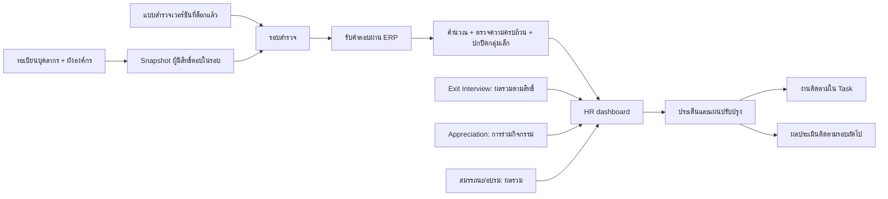

# แผนเก็บข้อมูลความผูกพันและเชื่อม HR dashboard

วันที่ตรวจ: 8 กันยายน 2569 · สถานะ: พัฒนา MVP และติดตั้ง migration ในเครื่องพัฒนาแล้ว ดูขอบเขตและขั้นตอนใช้งานใน [คู่มือการติดตั้ง](hr-engagement-implementation.md)

## ข้อสรุป

เพิ่มชุดข้อมูล `hr_engagement_*` ภายในโมดูล HR สำหรับแบบสำรวจบุคลากรที่ยังปฏิบัติงาน ใช้ทะเบียนบุคลากรเป็นแหล่งรายชื่อ ใช้ Exit Interview และ Appreciation เป็นข้อมูลประกอบแบบภาพรวม และเชื่อมแผนปรับปรุงกับระบบ Task ภายหลัง ไม่ใช้คำตอบ Exit Interview คะแนนกิจกรรม หรือคะแนนสมรรถนะเป็นคะแนนความผูกพัน

เริ่มจากแบบสำรวจหนึ่งเวอร์ชัน รอบสำรวจหนึ่งรอบ การตอบผ่านบัญชี ERP ผลสรุปที่ปกปิดกลุ่มเล็ก และแผนติดตามผล ก่อนเพิ่มนำเข้าข้อมูลภายนอกหรือแบบสำรวจสั้นหลายรอบ

## 1. สิ่งที่ตรวจพบจากโครงสร้างจริง

| ส่วนที่มีอยู่ | หลักฐานใน repository | นำมาใช้ / ข้อจำกัด |
|---|---|---|
| ทะเบียนบุคลากร | `modules/hr/models/Employees.php`; `employees`, `employee_detail` | ใช้ `employees.id` เป็นรหัสอ้างอิงในทะเบียนผู้มีสิทธิ์ตอบ; เก็บ snapshot เมื่อเปิดรอบ |
| โครงสร้างหน่วยงาน | `DefaultController::dashboardWorkgroupMap()`; `tree` ที่ `tb_name='diagram'` | department อาจเป็น node หลายระดับ ต้อง snapshot กลุ่มงานที่ resolve แล้ว ไม่ join categorise แบบเก่า |
| วันที่เริ่ม/สิ้นสุดงาน | `DefaultController::workforceSnapshotSql()` และ `inServiceWhereSql()` | มี fallback จากประวัติตำแหน่ง แต่ SQL ยังอยู่ใน private method; ไม่คัดลอกหลายแห่ง และไม่สมมติว่าแก้สถานะย้อนหลังได้ครบ |
| แบบสัมภาษณ์ผู้พ้นสภาพ | `ExitInterviewController.php`, `ExitInterviewService.php`, migration `m260824_100000_create_exit_interview_tables.php` | มี template/version/section/question/option/answer/link/audit และ RBAC ใช้เป็นแนวทางโครงสร้าง แต่ข้อมูลเป็นผู้พ้นสภาพและมีตัวตน จึงไม่ใช้ตารางเดิมเก็บผลสำรวจคนปัจจุบัน |
| การปกปิดกลุ่มเล็ก | `ExitInterviewService::MINIMUM_ANALYTICS_GROUP = 5` | เป็นค่าที่โค้ดเดิมเลือก ไม่ใช่เกณฑ์ HA; ระบบใหม่ต้องปกปิดตัวตั้ง ตัวหาร ผลต่าง และ export ด้วย |
| การผูกผู้บันทึก | `ExitInterviewRecord::beforeSave()` | เติม `created_by/updated_by` อัตโนมัติ ห้ามสืบทอดกับคำตอบที่ต้องแยกตัวตน เพราะจะเผยผู้ตอบผ่านบัญชี |
| กิจกรรม/แบบสอบถามภายนอก | `AppreciationActivity`, `AppreciationParticipation`, `ActivityController` | `TYPE_SURVEY` เป็นประเภทกิจกรรมและมี external_url แต่ไม่พบที่เก็บคำตอบรายข้อ/สูตรคะแนนความผูกพัน |
| สถานะกิจกรรม | `ActivityController::actionJoin()` | ถ้าไม่ต้องตรวจหลักฐาน สามารถเป็น COMPLETED ตั้งแต่ลงทะเบียน ก่อนเปิดลิงก์ภายนอก จึงใช้แทน survey submitted ไม่ได้ |
| Snapshot กิจกรรม | `AppreciationSnapshotService::employee()`; migration `m260719_000005_add_hr_analytics_snapshots.php` | snapshot หน่วยงานจากทะเบียนปัจจุบัน ณ เวลาบันทึก แม้รับ eventDate เพื่อคำนวณอายุ จึงไม่ใช่ประวัติหน่วยงานย้อนหลังที่สมบูรณ์ |
| สมรรถนะ | `CompetencyEvaluation`, `hr_competency_evaluation` | มีสถานะ submitted และ score_percent ใช้เฉพาะผลรวมด้านการพัฒนาในรอบที่ตรงกัน ไม่ join รายคนเข้าคำตอบความผูกพัน |
| การพัฒนา | `DevelopmentDetail`, `development_detail` | มี emp_id เป็น string และมี deleted_at ต้องตรวจการแปลงรหัส/สถานะ/soft delete ก่อนนับคนไม่ซ้ำ |
| งานติดตาม | `modules/task/models/Task.php` | มีผู้รับผิดชอบ หน่วยงาน due_date สถานะ และ source_module/source_id แต่ source รองรับ dms/manual/pm; ต้องเพิ่ม integration อย่างมีขอบเขต ไม่ส่งชื่อ source ใหม่โดยยังไม่แก้ validation |

ขอบเขตหลักฐาน: ตรวจ source code และ migrations ไม่ได้ตรวจ metadata/จำนวนแถวของฐานข้อมูลจริง ไม่ได้ยืนยันว่าทุก migration ถูกใช้แล้วใน production เอกสาร README บางส่วนล้าหลัง controller จึงยึด implementation เป็นหลัก

## 2. โครงสร้างการเชื่อมต่อ

เชื่อมผลรายโมดูลด้วยรอบเวลาและรหัสกลุ่ม snapshot ที่ตกลงร่วมกัน แสดงช่วงเวลาแต่ละชุดอย่างชัดเจน หากคนละช่วงหรือคนละนิยามกลุ่ม ห้ามแสดงเป็นการเปรียบเทียบตรงกันและห้ามตีความเป็นเหตุและผล

## 3. แบบสำรวจและวงจรข้อมูล

**แยกผลความผูกพันออกจากปัจจัยสนับสนุน**: ชุด outcome เช่น ความภูมิใจ ความเต็มใจทุ่มเท ความตั้งใจอยู่ต่อ; ชุด driver เช่น หัวหน้างาน การยอมรับ โอกาสพัฒนา ความชัดเจนของบทบาท ภาระงาน และสภาพการทำงาน ทั้งหมดเป็นหมวดเสนอ ต้องให้ HR/ทีมคุณภาพเลือกเครื่องมือที่เหมาะกับบริบท หากมีแบบเดิมให้รักษารหัสข้อ รุ่น และวิธีคิดคะแนนเพื่อเทียบย้อนหลัง

สเกลเริ่มต้นที่เสนอ: 1–5 พร้อม “ไม่เกี่ยวข้อง/ไม่ประสงค์ตอบ” แยกเป็น missing ไม่ใช้เลข 0; ช่องความคิดเห็นเป็น optional ไม่บังคับเขียนเหตุการณ์ส่วนตัว ไม่เก็บข้อมูลสุขภาพรายบุคคลในแบบความผูกพัน

วงจร: ร่างแบบ → ตรวจภาษา/สูตร/สิทธิ์ → เผยแพร่เวอร์ชัน → ร่างรอบ → preview รายชื่อและจำนวนกลุ่ม → ยืนยัน snapshot/เปิดรอบ → รับคำตอบ → ปิดรอบ → ตรวจคุณภาพ/คำนวณ → เผยแพร่ผลรวม → สร้างแผนปรับปรุง → ติดตามผล

- เวอร์ชันที่เผยแพร่แก้ข้อคำถาม/คะแนนย้อนหลังไม่ได้ ต้อง clone version ใหม่
- กำหนด eligible ณ วันเปิดรอบ; การย้ายหน่วยงานหลังเปิดรอบไม่เปลี่ยนตัวหารและกลุ่มย้อนหลัง
- การเพิ่ม/ถอนรายชื่อก่อนเผยแพร่ผลต้องมีเหตุผล รุ่น cohort และ audit; การเผยแพร่แล้วต้องสร้าง revision และแสดงว่าปรับปรุงผล ไม่เขียนทับเงียบ ๆ
- เปิด/ปิดรอบเก็บ UTC ในฐานข้อมูล แสดง Asia/Bangkok ใช้เงื่อนไข `open_at <= now < close_at` พร้อม `fiscal_year` ที่ชัดเจน
- MVP ไม่เก็บ draft คำตอบบน server; ตอบและยืนยันครั้งเดียว ลดข้อมูลตกค้างและความซับซ้อนการกู้ draft ต้องแจ้งเมื่อออกจากหน้าที่ยังไม่ส่ง
- ส่งซ้ำ/กดสองครั้งต้องคืนผลเดิม ไม่สร้างคำตอบเพิ่ม ใช้ transaction, unique constraint และ idempotency key

## 4. ตารางเสนอสร้าง

ชื่อและชนิดข้อมูลเป็นแบบออกแบบ ต้องตรวจชนิด FK กับฐานข้อมูลจริงก่อนเขียน migration ใช้ InnoDB/utf8mb4 และ FK แบบ RESTRICT กับแบบ/รอบที่มีคำตอบ ไม่ลบประวัติแบบ cascade โดยอัตโนมัติ

| ตาราง | ฟิลด์สำคัญ | Constraints / หน้าที่ |
|---|---|---|
| `hr_engagement_template` | id, code, title, status | unique(code); ตระกูลแบบสำรวจ |
| `hr_engagement_version` | id, template_id, version_no, status, scoring_policy_json, comparability_key, published_at/by | unique(template_id,version_no); scoring_policy ล็อกเมื่อเผยแพร่ |
| `hr_engagement_dimension` | id, version_id, code, title, kind(outcome/driver), sequence | unique(version_id,code); กำหนดว่าด้านใดเข้า engagement score |
| `hr_engagement_question` | id, version_id, dimension_id, code, prompt, type, required, reverse_scored, sequence | unique(version_id,code); FK/validation บังคับ dimension อยู่ version เดียวกัน |
| `hr_engagement_option` | id, question_id, code, label, score, is_missing | unique(question_id,code); ไม่คำนวณ is_missing |
| `hr_engagement_round` | id, code, version_id, fiscal_year, open_at, close_at, cohort_at, status, privacy_policy_version, minimum_group_size, cohort_revision, result_revision | unique(code); snapshot สูตรและนโยบายก่อนเปิดรอบ |
| `hr_engagement_cohort` | id, round_id, group_code, group_label, grouping_kind, parent_group_code, eligible_count | กลุ่มรายงานที่อนุมัติล่วงหน้า; ไม่เปิดกรองประชากรทุกมิติอย่างอิสระ |
| `hr_engagement_invitation` | id, round_id, emp_id, respondent_key, department/group/type/tenure snapshots, eligible_status, delivery_status, completion_status | unique(round_id,emp_id), unique(respondent_key); พื้นที่ข้อมูลระบุตัวตน จำกัดสิทธิ์ |
| `hr_engagement_response` | id, round_id, respondent_key, idempotency_key, status, source, submission_day | unique(round_id,respondent_key), unique(round_id,idempotency_key); คำตอบเป็นความลับแบบ pseudonymous ไม่ใช่นิรนามอย่างสมบูรณ์ |
| `hr_engagement_answer` | response_id, question_id, option_id nullable, numeric_value nullable, free_text nullable | unique(response_id,question_id); บังคับ question อยู่ version ของ round, option อยู่ question, ค่าอยู่ในสเกล; ห้ามเชื่อ client-computed score |
| `hr_engagement_result` | round_id, cohort_id, dimension_code, result_revision, metric_code, eligible_n, respondent_n, valid_n, value, suppression_reason, computed_at, policy_hash | unique(round_id,cohort_id,dimension_code,result_revision,metric_code); เป็น cache ผลรวม คำนวณซ้ำได้ ไม่ใช่แหล่งคำตอบ |
| `hr_engagement_action` | id, round_id, cohort_id nullable, dimension_code, issue_summary, owner_emp_id, owner_unit_id, due_date, baseline_result_ref, target, status, task_id nullable, followup_round_id nullable, effectiveness_note | เจ้าของแผนมีตัวตนได้ แต่เนื้อหาไม่มีคำตอบดิบหรือชื่อผู้ตอบ |
| `hr_engagement_audit` | id, event, actor_id, round_id, object_type, object_id, reason, occurred_at | เก็บการเปิดรอบ/เผยแพร่/เปลี่ยนสิทธิ์/นำเข้า/ส่งออก/ลบตามอายุข้อมูล ไม่เก็บ payload คำตอบหรือคู่ user–response |

MVP รวมประมาณ 13 ตาราง แยกคำตอบออกจากรายชื่อและผลรวมอย่างชัดเจน ยังไม่ต้องมีตาราง notification, import หรือ token-link จนกว่าจะเปิดฟีเจอร์เหล่านั้น

Index เพิ่มตาม query: response(round_id,status), invitation(round_id,completion_status), result(round_id,result_revision,cohort_id), action(owner_emp_id,status,due_date) รหัส snapshot ของหน่วยงานคงไว้แม้ผังเปลี่ยน ไม่ทำ FK ที่ทำให้ข้อมูลอดีตเปลี่ยนตาม master

## 5. ความลับและสิทธิ์

ข้อเสนอ MVP คือ **แบบสำรวจเป็นความลับ รายงานเป็นภาพรวม** ไม่แสดงข้อความว่า “ไม่สามารถระบุตัวผู้ตอบได้” เพราะ respondent_key ยังเชื่อม invitation ได้ในระดับระบบ/ผู้ดูแลฐานข้อมูล แยกตารางอย่างเดียวไม่ทำให้เป็นนิรนาม หากองค์กรต้องการนิรนามจริง ต้องเปลี่ยนวิธีออกสิทธิ์ตอบ การเก็บ log และการติดตามผู้ตอบก่อนเริ่มพัฒนา ไม่ใช่เพียงลบชื่อออกจากหน้าแสดงผล

| Permission เสนอ | ผู้ใช้ | ขอบเขต |
|---|---|---|
| `engagementManageTemplate` | HR ที่ดูแลเครื่องมือ | จัดการแบบและเวอร์ชัน ไม่มีคำตอบ |
| `engagementManageRound` | ผู้ดูแลรอบ | snapshot รายชื่อ เปิด/ปิดรอบ ดูอัตราตอบรวม ส่งเตือนตาม workflow ไม่มีคำตอบรายบุคคล |
| `engagementRespond` | ผู้มีสิทธิ์ในรอบ | ตอบเฉพาะรอบของตน Server หา emp_id จาก session ไม่รับ emp_id จากฟอร์ม |
| `engagementViewAnalytics` | HR/ทีมคุณภาพ | ผลรวมที่ผ่าน suppression ใน scope ที่ได้รับอนุญาต |
| `engagementViewUnitAnalytics` | หัวหน้าหน่วยงาน | เฉพาะหน่วยงานที่ได้รับสิทธิ์ ไม่เห็นรายชื่อผู้ยังไม่ตอบหรือคำตอบดิบ |
| `engagementManageAction` | เจ้าของแผน/HR | แผนปรับปรุงใน scope ของตน |
| `engagementExportAggregate` | ผู้ได้รับอนุญาตส่งออก | ผลรวมที่ใช้ suppression เดียวกับหน้าเว็บ |
| `engagementDataCustodian` | ผู้ดูแลข้อมูลที่แต่งตั้งแยก | งานแก้ข้อมูล/retention ตามเหตุผลและ audit; ไม่มีหน้า join คำตอบกับชื่อใน MVP |

ห้ามใช้ Base ActiveRecord ที่เติม user id อัตโนมัติกับ response/answer; ห้ามบันทึกคำตอบใน debug toolbar, request body logs, analytics, error trace หรือ audit การส่งคำตอบ; ตรวจ reverse proxy/APM ด้วย กำหนดอายุ invitation/คำตอบ/ความคิดเห็น/backup ก่อน go-live และทดสอบ purge โดยใช้ข้อมูลสังเคราะห์

ผลระหว่างเปิดรอบแสดงเฉพาะการตอบกลับตาม scope; คะแนนเผยแพร่หลังปิดรอบและตรวจสอบแล้ว ค่าเริ่มต้น minimum_group_size เสนอ 5 ตามแนวทางในโค้ดเดิม แต่ต้องอนุมัติก่อนใช้ และไม่รับประกันการไม่ระบุตัวตนด้วยค่าเดียว

ปกปิดเมื่อ eligible หรือ valid respondent ของตัวชี้วัดต่ำกว่าเกณฑ์; ปกปิดเซลล์เสริมเมื่อยอดรวมใช้ลบหาเซลล์เล็กได้; ใช้กลุ่มรายงานที่กำหนดล่วงหน้าและผล revision เดียว ไม่เปิดกรองอายุ+วิชาชีพ+เพศ+หน่วยงานจนเหลือรายคน ต้องใช้กติกาเดียวกันใน API, tooltip, CSV, drill-down และ cache ไม่ส่งค่าจริงของ suppressed cell ไป browser

ความคิดเห็นปลายเปิดไม่แสดงคำพูดดิบใน dashboard ให้ผู้ดูแลที่ได้รับสิทธิ์สรุปเป็นประเด็นและลบรายละเอียดที่ระบุตัวได้ก่อนเผยแพร่

## 6. นิยามตัวชี้วัดเสนอ

| ตัวชี้วัด | สูตร / เงื่อนไข | กราฟ |
|---|---|---|
| อัตราตอบกลับ | submitted ที่ยัง valid และไม่ซ้ำ ÷ eligible ใน cohort revision เดียวกัน × 100 | แท่ง/สัดส่วนตอบแล้ว–ยังไม่ตอบ; 0 eligible แสดง N/A |
| คะแนนรายด้าน | กลับทิศข้อ reverse ด้วย `6 − score`; เฉลี่ยข้อ valid ในด้านต่อผู้ตอบ แล้วเฉลี่ยผู้ตอบที่ผ่านเกณฑ์ความครบถ้วน | แท่ง 1–5 พร้อมจำนวนผู้ตอบ valid |
| คะแนนความผูกพันรวม | ใช้เฉพาะ outcome dimensions ที่กำหนดใน version; เฉลี่ยตามน้ำหนักที่ล็อกไว้ ห้ามผสม driver/กิจกรรม/สมรรถนะ | ค่ารวม + เส้นตามรอบที่ comparable |
| คะแนนแปลง 0–100 (ถ้าต้องใช้) | `(mean − 1) ÷ 4 × 100` สำหรับสเกล 1–5; เป็นดัชนีคะแนน ไม่ใช่เปอร์เซ็นต์คนผูกพัน | แสดงคำว่า “ดัชนี” และสูตร |
| สัดส่วนคำตอบเชิงบวก | ข้อ valid ที่ได้ 4–5 หลังกลับทิศ ÷ ข้อ valid ทั้งหมดในหมวด × 100 | แท่งซ้อนบวก/กลาง/ลบ; ไม่เรียกสัดส่วนพนักงานผูกพัน |
| eNPS (optional) | ถ้ามีคำถาม 0–10 ตามนิยามที่ตกลง: % ผู้ให้ 9–10 − % ผู้ให้ 0–6; 7–8 อยู่ในตัวหาร | แยกจาก engagement score; ไม่คำนวณจากสเกล 1–5 |
| การปิดแผนตรงเวลา | แผนที่เสร็จไม่เกิน due date ÷ แผนที่ครบกำหนดในช่วง × 100; แยก cancelled | แท่งตามสถานะแผน |
| ผลหลังปรับปรุง | ผล outcome/driver รอบติดตามเทียบ baseline ที่ comparable พร้อมขนาดกลุ่ม/อัตราตอบ | กราฟก่อน–หลัง; ไม่สรุปว่าแผนเป็นสาเหตุโดยตรง |

เกณฑ์ความครบถ้วนเสนอ: ต้องมีอย่างน้อย 80% ของข้อใน dimension ที่ใช้ได้จึงคิด mean ด้านนั้น; ต้องมี outcome dimensions ครบตาม policy จึงเข้าสูตรคะแนนรวม กำหนดชัดใน scoring_policy_json ก่อนเปิดรอบ แสดง valid_n ของแต่ละด้าน ไม่ใช้จำนวนผู้ส่งทั้งหมดแทน valid_n

ตัวอย่างทดสอบสังเคราะห์: eligible=100, submitted=60 → response rate=60%; ค่า outcome mean=4 → index=75 ไม่ใช่ 80%; N/A ไม่ลงตัวหาร; ไม่มี valid answer → value=null พร้อม reason; จำนวนผู้ตอบ 4 คนเมื่อ threshold=5 → suppressed ไม่ใช่ 0

## 7. จุดเชื่อมและสัญญาข้อมูล

เพิ่ม service ภายใน `modules/hr/services` (ชื่อเสนอ ยังไม่มี implementation):

- `WorkforceSnapshotService`: ย้าย/ห่อ logic รายชื่อที่ตรวจสอบแล้ว โดยทดสอบเทียบ dashboard เดิมก่อนเปลี่ยนผู้เรียก; snapshot โครงสร้างปัจจุบันสำหรับรอบใหม่ ไม่อ้างว่ารองรับ historical transfer ถ้าไม่มี effective dates
- `EngagementRoundService`: validate cohort, freeze version, เปิด/ปิดรอบและสิทธิ์
- `EngagementResponseService`: ตรวจผู้มีสิทธิ์ ช่วงเวลา version/question/option, transaction และ dedup; อัปเดต completion เฉพาะหลัง commit
- `EngagementAnalyticsService`: คำนวณคะแนน server-side, suppression, revision และ cache
- `EngagementActionService`: บันทึกประเด็น/ติดตามประสิทธิผล; Task adapter ตามมาระยะหลัง พร้อม unique mapping ป้องกันสร้างงานซ้ำ
- `HrDashboardService`: รวมผลที่ได้รับอนุญาตจาก engagement/exit/appreciation/competency โดยผลรวม ไม่ query คำตอบดิบใน view และไม่ส่งให้ client แล้วค่อยซ่อน

DTO สำหรับแต่ละ metric: `metric_code, round_id, fiscal_year, period_start, period_end, cohort_code, value, unit, valid_n, eligible_n, status, reason, source, result_revision, policy_version, comparable_key, updated_at` โดย status แยก `ok / no_data / suppressed / not_connected / not_authorized / not_comparable` ค่ากับ n ที่อาจเผย suppressed group ต้องเป็น null

HR dashboard ใช้ปีงบประมาณเลือกรอบที่อยู่ในปีนั้น หากมีหลายรอบให้เลือก “รอบสำรวจ” เพิ่ม ไม่เลือกเงียบ ๆ ด้วยปีเดียว ตัวกรอง gen/เพศ/ตำแหน่งรายคนเดิมไม่ส่งผ่านสู่ engagement อัตโนมัติ ใช้เฉพาะกลุ่มที่อนุมัติและแจ้งขอบเขตบนกราฟ

Exit Interview เรียกผลผ่าน service/adapter ที่ตรวจ `exitInterviewViewAnalytics` และ scope; ไม่ join respondent_key/emp_id กับ engagement; วันสิ้นสุดงานใน Exit Interview ปัจจุบันเริ่มจาก end_date แต่ dashboard ใช้ fallback จึงต้องตรวจ/แสดง source date ก่อนเทียบยอด

Appreciation เชื่อมแค่ลิงก์เข้าสู่รอบสำรวจใน MVP ไม่ให้คะแนนการเข้าร่วมแทนคะแนนคำตอบ หากเพิ่ม completion callback ภายหลัง ให้ส่งเพียง completion receipt แบบ idempotent ไม่มีคะแนน/คำตอบ และเกิดหลัง submit สำเร็จ ไม่ใช้สถานะลงทะเบียนเดิมยืนยันผล

ข้อมูลสมรรถนะ/อบรมให้เป็นผลรวมอีกชุดหนึ่งพร้อมช่วงเวลาและขอบเขต หลีกเลี่ยงการรวมหลายตารางรายละเอียดตรง ๆ ซึ่งทำให้จำนวนคนซ้ำ ต้อง aggregate distinct employee ต่อ source ก่อนรวม DTO

## 8. หน้าจอเสนอและลำดับพัฒนา

| ระยะ | งาน | เกณฑ์ผ่าน |
|---|---|---|
| 0 — ตรวจข้อมูลและยืนยันนิยาม | ตรวจ metadata/migration status ใน dev และ production แบบ read-only; ตรวจ master หน่วยงาน/รหัสบุคลากร วันเริ่ม–สิ้นสุด; เลือกแบบ/สูตร/privacy/retention | data dictionary และขอบเขตสิทธิ์ยืนยันแล้ว; แยกของที่มีในโค้ดจากที่ใช้จริง |
| 1 — แบบและรอบสำรวจ | migration additive + RBAC; หน้าแบบสำรวจ/เวอร์ชัน, รอบ, preview cohort และเปิดรอบ | published immutable, cohort stable, invalid transition ถูกปฏิเสธ, ไม่มีการแก้ตารางเก่า |
| 2 — รับคำตอบ | หน้า “แบบสำรวจของฉัน” ใน HR/Me, ส่งครั้งเดียว, รองรับมือถือ, แยกข้อมูลตัวตน/คำตอบ | non-eligible/expired/duplicate/ข้าม version ส่งไม่ได้; ไม่หลุดคำตอบใน log; ใช้ข้อมูลสังเคราะห์ทดสอบ |
| 3 — วิเคราะห์และ dashboard | คำนวณหลังปิดรอบ, กราฟคะแนนรายด้าน/อัตราตอบ/แนวโน้ม, suppression, aggregate export | สูตร/n ตรง test vectors, ไม่มี suppressed value ใน payload/export, no data ไม่เป็น zero |
| 4 — แผนปรับปรุง | เลือกประเด็นจากผลที่เผยแพร่ ตั้งเจ้าของ/วันติดตาม/เป้าหมาย และประเมินผล | แยก “ทำงานเสร็จ” จาก “ปัญหาดีขึ้น”; ไม่คัดลอกความคิดเห็นดิบลง Task |
| 5 — เชื่อมระบบประกอบ | Task adapter, Appreciation receipt, Exit/competency aggregate; import ภายนอกเมื่อจำเป็น | source permissions/scope ไม่ถูกขยาย, dedup, reconciliation, cohort/period mismatch มีข้อความ |

หน้าจอใช้มาตรฐาน ERP เดิม: Bootstrap 5.3, ฟอร์มไทย, card/table/filter, ApexCharts, light/dark; registry มี DataSummaryWidget ที่ footer; ไม่สร้าง design system ใหม่

MVP ครอบคลุมระยะ 0–4 โดยแผนปรับปรุงอยู่ใน HR ก่อน Task adapter พร้อม ส่วนระยะ 5 ทำตามความพร้อมของข้อมูล ไม่บังคับเชื่อมทุกโมดูลเพื่อเปิดสำรวจครั้งแรก

## 9. Acceptance tests และการนำขึ้นระบบ

- Reference calculations: missing/reverse/weights/unequal valid questions/rounding; ทดสอบว่า index กับ favorable percent เป็นคนละ metric
- Cohort: ย้ายงานระหว่างรอบ ผู้เข้าใหม่ ผู้พ้นสภาพ หน่วยงานถูกเปลี่ยนชื่อ unknown group และ denominator revision
- Integrity: duplicate submit พร้อมกัน, option ต่าง question, question ต่าง version, รอบปิดระหว่างส่ง, response transaction rollback แล้ว completion ไม่เปลี่ยน
- Privacy: สิทธิ์หัวหน้าข้ามหน่วยงาน, direct URL, CSV/tooltips/cache, suppressed total subtraction, comment ระบุตัวตน และ record behavior ไม่เติม created_by ลงคำตอบ
- Integration: Appreciation completed ที่เกิดจาก join ต้องไม่นับเป็น response; Exit Interview ประชากร/ช่วงเวลาไม่ถูกนำมาหารรวมกับ survey; รายละเอียดอบรมหลายรายการไม่เพิ่มคนซ้ำ
- UI: desktop/mobile/light/dark, keyboard, validation/error recovery, chart no-data/suppressed ไม่แสดง 0 หรือเส้นเชื่อมช่วงที่เทียบไม่ได้
- Deployment: สำรองตาม workflow เดิม, migrate บน staging, เปิด feature ให้เฉพาะผู้ทดลองด้วยข้อมูลสังเคราะห์, ตรวจ source reconciliation แล้วจึงเปิดรอบจริง; ห้ามย้อน migration แบบ drop เมื่อมีคำตอบจริง ให้ disable feature และแก้แบบ forward

## 10. เรื่องที่ต้องตกลงก่อนเริ่มเก็บคำตอบจริง

1. ใช้แบบโรงพยาบาลเดิมหรือแบบใหม่ และข้อใดเป็น outcome/driver
2. เป็นความลับแบบระบุตัวได้เฉพาะผู้ดูแลระบบตามแผนนี้ หรือจำเป็นต้องนิรนามจริง
3. ผู้มีสิทธิ์ตอบ รอบเวลา กลุ่มที่อนุญาตรายงาน และ minimum group size
4. สูตร เกณฑ์ valid response น้ำหนัก และเป้าหมายที่องค์กรกำหนดเอง
5. ผู้ดูแลข้อมูล สิทธิ์รายชื่อผู้ยังไม่ตอบ อายุข้อมูล/backup และผู้อนุมัติเผยแพร่ผล

ข้อเหล่านี้ไม่ขวางการทำ schema/prototype ด้วยข้อมูลสังเคราะห์ แต่ต้องมีคำตอบก่อน publish รอบจริง ไม่ตั้งสมมติฐานให้กลายเป็นนโยบายโดยอัตโนมัติ

## การเชื่อม HA

ใช้ผลสำรวจประกอบงาน I-5.2 และผลลัพธ์บุคลากร IV-3 โดยเก็บทั้งสิ่งที่พบ แผนดำเนินการ และผลติดตาม ตัวชี้วัด สูตร และเกณฑ์ความลับในแผนนี้เป็นข้อเสนอของระบบ ไม่ใช่ค่าบังคับจาก HA อ้างอิง [แบบประเมิน SAR 2026 ของ สรพ. หน้าเอกสาร 16–18](https://backend.ha.or.th/fileupload/DOCUMENT/00183/280fa7c4-8100-433d-b114-c78372802bf2.pdf)
